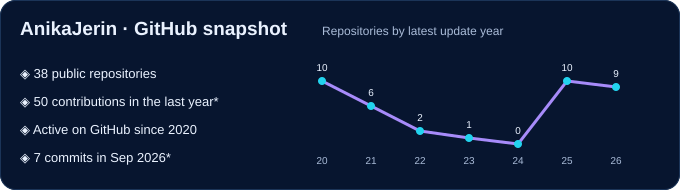
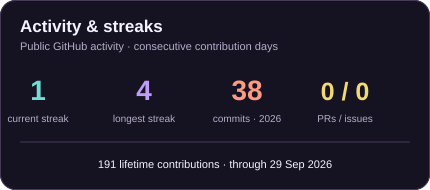
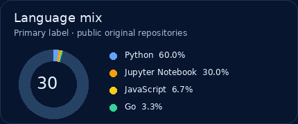
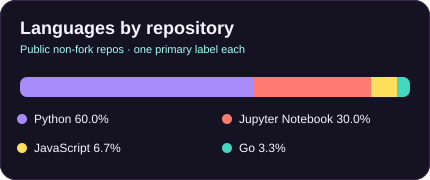

# Hi, I'm Syeda Anika Jerin 👋

**Software Engineer · AI Engineer · Tech Lead**

I’m a software engineer with over five years of experience building enterprise platforms, customizing Odoo and AI-powered systems, and developing practical solutions for complex workflows. My work spans government and enterprise organizations, imaging, multimodal AI, computer vision, HCI, and interactive 3D applications.

&nbsp; &nbsp; 

🌿 Beyond the Code

📚 **Bookworm** — always somewhere between one more chapter and one more book.  
🎨 **I paint** — when my brain needs a different kind of canvas.  
🔭 **Curious by nature** — I love exploring ideas, learning unfamiliar things, and seeing where they lead.

🇫🇷 **Funny Thing: I'm Taking French Lessons** — *Prends le temps de vivre.* 🌻  
Take time to live.

### GitHub analytics

<table>
<tr>
<td width="62%"></td>
<td width="38%"></td>
</tr>
<tr>
<td width="50%"></td>
<td width="50%"></td>
</tr>
</table>

### My engineering map

<table>
<tr><td align="center" width="25%"><strong>BUILD & CONNECT</strong></td><td> Odoo · OWL · Python · PostgreSQL · APIs</td></tr>
<tr><td align="center"><strong>LEARN FROM DATA</strong></td><td> Computer vision · Machine learning · Multimodal AI</td></tr>
<tr><td align="center"><strong>MAKE IT VISIBLE</strong></td><td> Three.js · ECharts · amCharts · Chart.js</td></tr>
</table>
