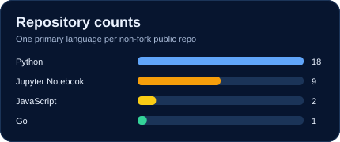

# Hi, I'm Anika Jerin 👋

**Software Engineer · AI Engineer · Research Explorer**

I turn complex workflows and research ideas into software people can use. Over seven years, I've built enterprise platforms and Odoo systems, contributed to traffic-monitoring and weather-data solutions, and explored medical AI, computer vision, HCI, and interactive 3D.

[Portfolio](https://anikajerin.github.io/anika-portfolio/) · [Repositories](https://github.com/AnikaJerin?tab=repositories) · [LinkedIn](https://www.linkedin.com/in/anika-jerin/)

### GitHub analytics

<table>
<tr>
<td width="65%"></td>
<td width="35%"></td>
</tr>
<tr>
<td width="50%"></td>
<td width="50%"></td>
</tr>
</table>

### My engineering map

<table>
<tr><td align="center" width="25%"><strong>BUILD & CONNECT</strong></td><td> Odoo · OWL · Python · PostgreSQL · APIs</td></tr>
<tr><td align="center"><strong>LEARN FROM DATA</strong></td><td> Computer vision · Machine learning · Multimodal AI</td></tr>
<tr><td align="center"><strong>MAKE IT VISIBLE</strong></td><td> Three.js · ECharts · amCharts · Chart.js</td></tr>
</table>
