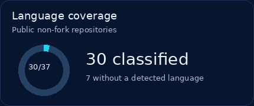
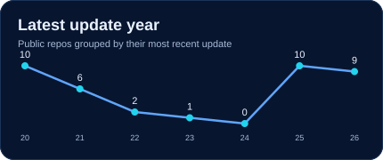

# Hi, I'm Anika Jerin 👋

**Software Engineer · AI Engineer · Research Explorer**

I turn complex workflows and research ideas into software people can use. Over seven years, I've built enterprise platforms and Odoo systems, contributed to traffic-monitoring and weather-data solutions, and explored medical AI, computer vision, HCI, and interactive 3D.

[Portfolio](https://anikajerin.github.io/anika-portfolio/) · [Repositories](https://github.com/AnikaJerin?tab=repositories) · [LinkedIn](https://www.linkedin.com/in/anika-jerin/)

### GitHub analytics

<table>
<tr>
<td width="50%"></td>
<td width="50%"></td>
</tr>
<tr>
<td width="50%"></td>
<td width="50%"></td>
</tr>
</table>

Public repository snapshot; the language panels count each non-fork repository once, not code bytes or proficiency. GitHub labels notebooks as “Jupyter Notebook.” The line groups repositories by their latest update year, so past points can move when a repository is edited. Cards refresh weekly through GitHub Actions.

### My engineering map

**BUILD & CONNECT** 
 
<strong>Odoo · OWL · Python · PostgreSQL · APIs</strong>

  

**↓ LEARN FROM DATA ↓** 
 
<strong>Computer vision · Machine learning · Multimodal AI</strong>

  

**↓ MAKE IT VISIBLE ↓** 
 
<strong>Three.js · ECharts · amCharts · Chart.js</strong>

